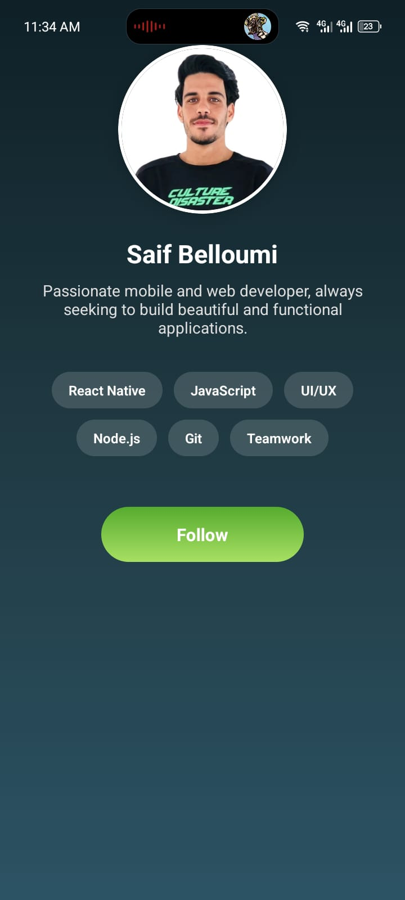

# 📱 My Profile App

A stylish **React Native** mobile app created using **Expo**.  
This project is part of the **TP3 – Profile App** assignment for the *Applications Mobiles Multiplateformes (IAM2)* course.

---

## ✨ Features
- 🎨 Gradient background using `expo-linear-gradient`
- 📱 Responsive Flexbox layout
- 🖼️ Local profile image (stored in `/assets`)
- 🔘 Animated “Follow” button
- 🧩 Skill badges with rounded design
- 🌈 Clean and modern UI with shadows and smooth borders

---

## 🛠️ Technologies Used
- React Native
- Expo
- JavaScript (ES6+)
- Expo Linear Gradient

---

## 📸 Screenshots

### 🏠 Home Screen



---

## 🚀 How to Run

1. **Clone this repository:**
   ```bash
   git clone https://github.com/Belloumisaif/MyProfileApp.git
   cd MyProfileApp
